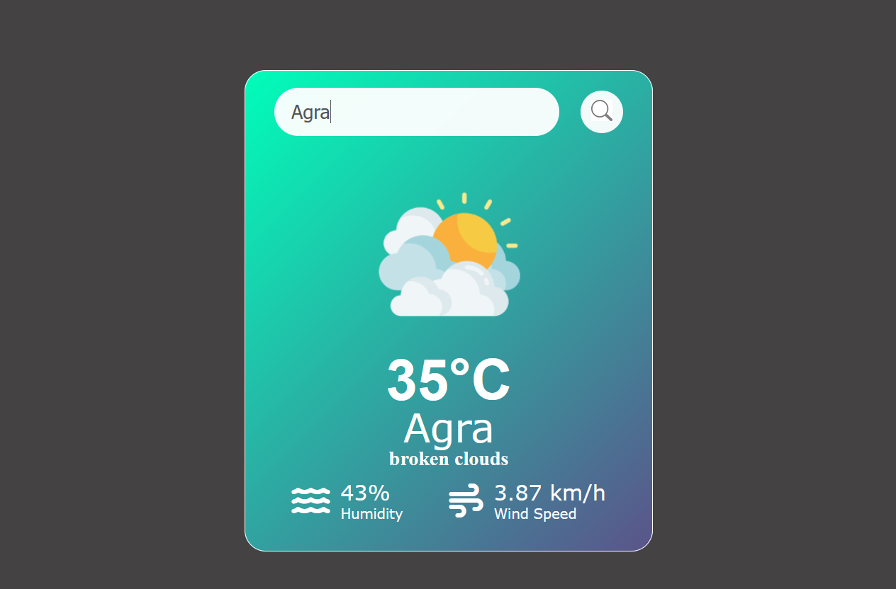

# Weather App

A simple and clean web-based weather application that allows users to retrieve the current weather conditions for any city. The app displays the temperature, a weather description, a dynamic icon representing the current weather, humidity, and wind speed. It is built purely with HTML, CSS, and vanilla JavaScript.

## Demo




## Features

- **City Search**: Enter the name of any city in the world to get its current weather.
- **Dynamic Data Display**: After a search, the app displays:
  - Temperature (in Celsius)
  - City Name
  - Humidity percentage
  - Weather description
  - Wind speed (in km/h)
- **Dynamic Weather Icons**: The icon changes based on the weather condition (e.g., Clouds, Rain, Clear, Mist, etc.).
- **Error Handling**: Provides a clear "Invalid city name" message if the location is not found or if there's an API error.
- **User-Friendly Input**: Works with both a button click and by pressing the 'Enter' key.

## Technologies Used

- **HTML5**: For the structure of the application.
- **CSS3**: For styling and layout, including the use of Flex-box.
- **JavaScript (ES6+)**: For fetching data from the API and handling all user interactions.
- **OpenWeatherMap API**: Used to fetch the live weather data.
- **Font Awesome**: For humidity and wind icons.

## Setup and Installation

To run this project on your local machine, follow these simple steps:

1.  **Download or Clone the Project**

    - Download the ZIP file and extract it, or clone the repository using Git:
      ```bash
      git clone [https://github.com/your-username/your-repository-name.git](https://github.com/your-username/your-repository-name.git)
      ```

2.  **Get a Free API Key**

    - This project requires an API key from OpenWeatherMap.
    - Go to [https://openweathermap.org/api](https://openweathermap.org/api) and sign up for a free account.
    - Find your API key on your account page.

3.  **Run the App**
    - Simply open the `index.html` file in your web browser (like Chrome, Firefox, or Edge).

## How to Use

1.  Open the `index.html` file.
2.  Type the name of a city into the search bar.
3.  Either click the search icon or press the `Enter` key.
4.  The current weather information for that city will be displayed.
